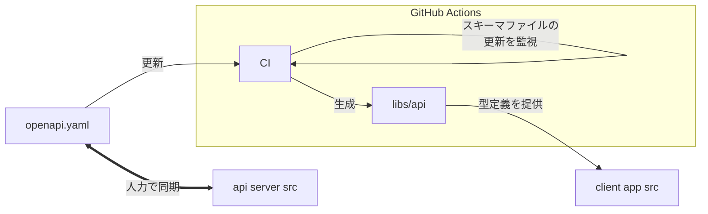

# OpenAPI について

このサーバに実装されている HTTP API は[OpenAPI](../openapi.yaml)(以下、スキーマファイル)で確認できます。

サーバの実装は必ずしもスキーマファイルと一致しません。なぜなら、人力で実装しているからです(i.e. 自動生成はしてない)。

一方で、typing-app ディレクトリのフロントエンドには OpenAPI から自動生成される型定義ファイル等が提供されます。開発者はこの型定義ファイルを利用して本 HTTP API にアクセスする**必要**があります。詳しくはこのワークフローファイル [generate-oapi-client-and-doc.yml](../../.github/workflows/generate-oapi-client-and-doc.yml) を参照してください。

## OpenAPI の立ち位置

